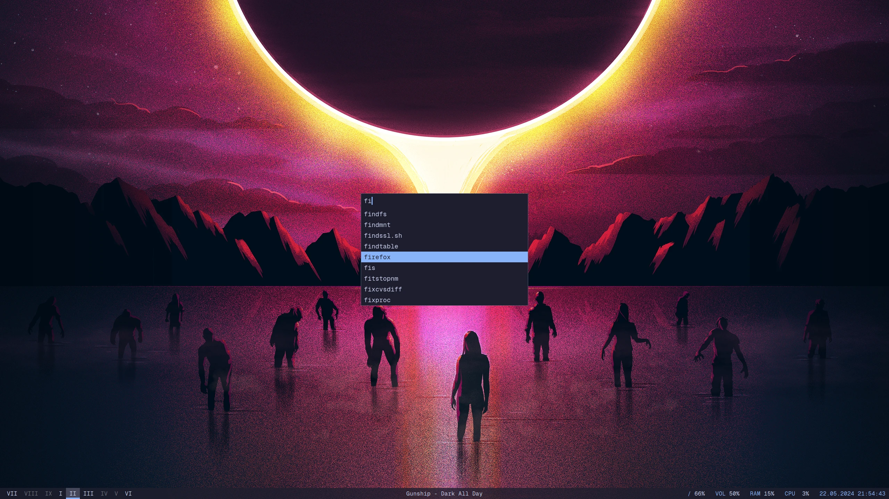
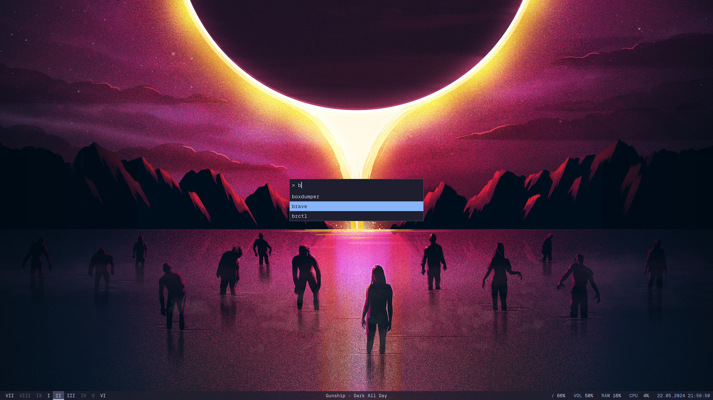
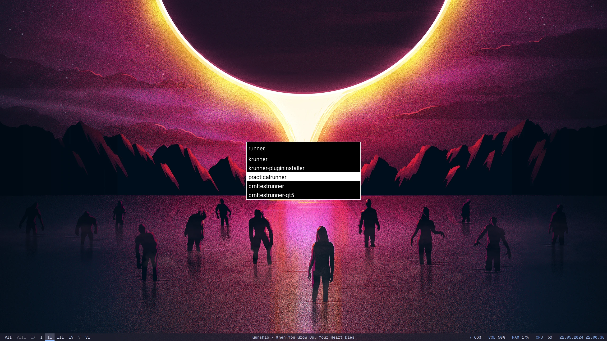

# practical-runner

A practical application runner written in Rust. Inspired by [dmenu](https://tools.suckless.org/dmenu/)

### Features
- theming (colors, font family, font size, line spacing, window border)
- custom row count
- prompt message
- open menu on a specific display
